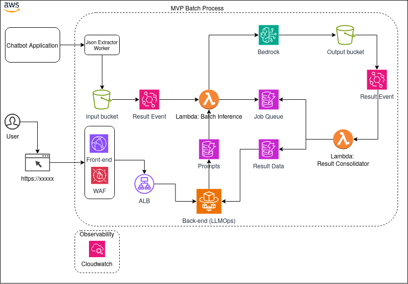
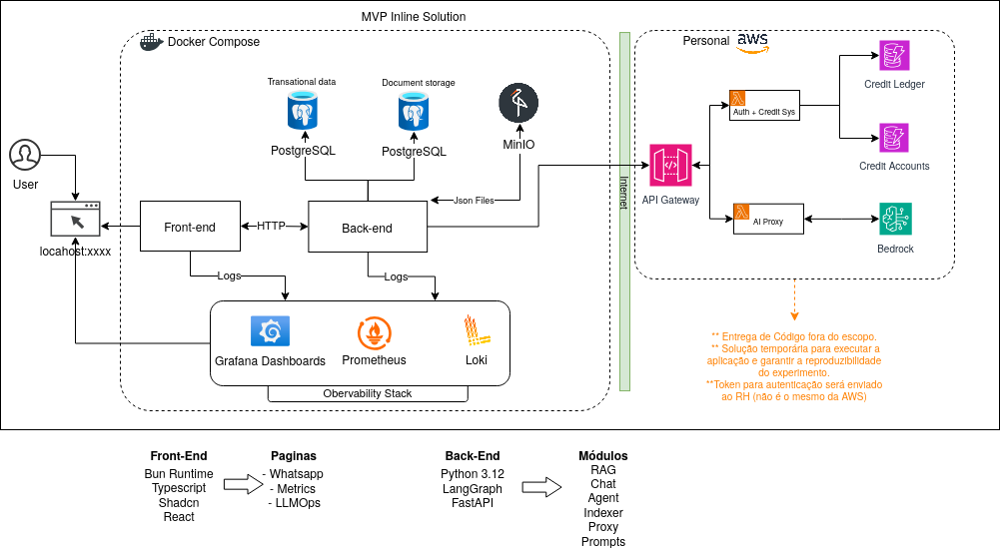
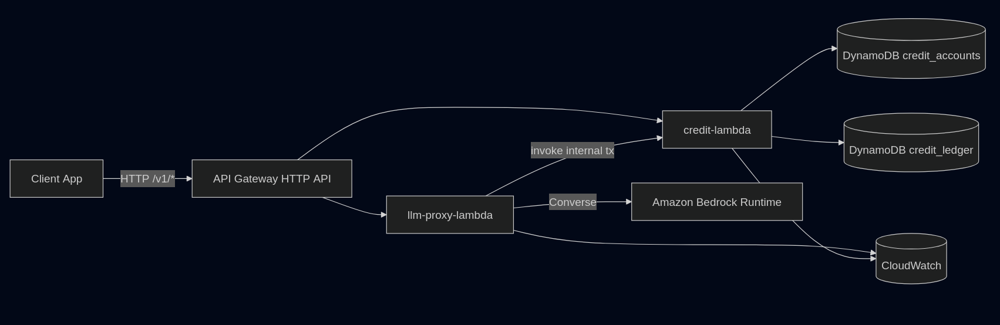

# Fluxo de Solucao - Case Coordenador de IA

## Teste Técnico Coordenador de IA

- Documento-base do desafio: `case/Teste Prático - Coordenador de IA (v2) 1.pdf`
- Contexto pratico do problema: avaliacao de qualidade de atendimento de uma IA operadora (Clara) em conversas de captacao/orientacao de alunos.
- Material de apoio usado no desenvolvimento:
  - `case/Teste Prático - Coordenador de IA - Exemplo Conversas.json`
  - `docs/` com arquitetura e documentos tecnicos
  - `docs/drafts/` com rascunhos, decisoes iniciais, perguntas e evolucao de abordagem

#### O desafio

A missao do teste e propor e implementar uma solucao de IA que:

- receba conversas de atendimento em canais digitais (chat e WhatsApp)
- tenha possibilidade futura de expansao para transcricoes de voz
- retorne avaliacao estruturada da qualidade de atendimento
- inclua scores, justificativas e evidencias extraidas da conversa

#### Premissas obrigatorias

Ao elaborar a proposta, o PDF pede considerar:

- viabilidade economica da operacao
- auditabilidade e rastreabilidade da analise
- evolucao de criterios de avaliacao ao longo do tempo
- uso inicial como apoio a avaliacao humana
- tratamento de possiveis dados sensiveis
- potencial de escala da solucao

#### O que a avaliacao espera observar

O case explicita que a entrega deve demonstrar, de forma integrada:

- visao arquitetural fim a fim
- estrategia de IA (prompts, modelos, orquestracao e trade-offs)
- comparacao de pelo menos duas abordagens arquiteturais
- prototipo funcional em funcionamento
- visao de operacao (monitoracao e evolucao em producao)

#### Entregaveis exigidos

1. Documento de solucao com:
- visao geral da solucao
- desenho do fluxo
- decisoes tecnicas
- estrategia de prompts
- estrategia de modelos
- estrategia de orquestracao
- comparacao entre alternativas arquiteturais
- riscos, limitacoes e proximos passos

2. Prototipo funcional com:
- repositorio com codigo-fonte
- instrucoes de execucao
- exemplo de requisicao e resposta
- processamento de conversa com retorno estruturado

3. Registro de uso de IA com:
- em quais partes foi utilizada
- finalidade de uso
- como as sugestoes foram validadas tecnicamente

## Introducao

Ola, sou Nicolas Melo, e trouxe duas propostas de solucao. Uma esta implementada utilizando o fluxo completo "emulando" o WhatsApp, aceitando transcricao de voz e com dois agentes (um de chatbot e outro de NPS). A outra solucao esta diagramada em `docs/arquitetura/mvp-batch-process.png`.

Durante a execucao do case, optei por manter todo o material no proprio repositorio, em estado RAW, para facilitar rastreabilidade da evolucao:

- em `docs` estao os documentos de arquitetura
- em `docs/drafts` estao rascunhos, questionamentos, stacks iniciais e decisoes
- em `services/` esta a implementacao funcional do MVP Inline Process

## Formulacao inicial do problema

Antes de implementar, tratei o problema como um caso de avaliacao operacional inspirado em NPS. A leitura das conversas de exemplo e dos rascunhos em `docs/drafts` mostrou que a pergunta principal nao era apenas "a IA respondeu?", mas sim "o cliente sentiu que avancou com clareza, pouco atrito e aderencia ao que buscava?".

### Steps iniciais

- leitura completa da proposta
- analise das conversas de exemplo
- identificacao de padroes de sucesso e falha
- definicao da perspectiva correta da avaliacao: cliente, nao bot
- levantamento de requisitos de custo, escala, auditabilidade e operacao

### Hipoteses que orientaram a solucao

- o problema se comporta como um NPS operacional aplicado a uma IA operadora
- transferencia para humano nao e ruim por si so; depende do contexto
- satisfacao sozinha nao basta; e preciso medir esforco, entendimento e resolucao
- sinal de fechamento ajuda, mas nao pode ser o unico criterio
- prompt injection, tokens e mudanca comportamental sao sinais operacionais relevantes

### Consequencia direta no desenho

Por isso a entrega foi dividida em duas trilhas complementares:

- um `MVP Inline Process` implementado para demonstrar o fluxo completo
- uma proposta `Batch Process` para o recorte ideal de custo e escala pedido no desafio

## Metodologia de avaliacao

A metodologia consolidada veio dos rascunhos em `docs/drafts/rules.md` e foi alinhada ao shape de resposta implementado no backend. A unidade de analise e a sessao, e a leitura sempre considera a experiencia do cliente ao longo da conversa inteira.

### Regra central

- ler a sessao pela perspectiva do cliente
- inferir o objetivo dominante da conversa antes de pontuar
- separar satisfacao percebida de metricas auxiliares
- registrar evidencias textuais curtas que sustentem a avaliacao

### Classificacao principal de satisfacao

| Valor | Classe | Regra pratica |
| --- | --- | --- |
| `3` | `Bom` | cliente avancou com baixo atrito, recebeu resposta util ou aceitou claramente o proximo passo |
| `2` | `Neutro` | houve progresso parcial, mas com lacunas, friccoes ou conclusao incompleta |
| `1` | `Ruim` | cliente precisou insistir, corrigir a IA, repetir contexto ou saiu sem resposta util |

### Indicador consolidado

```text
INDICE_IA_OPERADORA = % bom - % ruim
```

Esse indicador resume a operacao em logica inspirada em NPS, mas nao substitui os diagnosticos auxiliares.

### Metricas auxiliares

| Metrica | Escala | Leitura pratica | Peso inicial sugerido |
| --- | --- | --- | --- |
| satisfacao | `1 a 3` | resultado final percebido pelo cliente | `40%` |
| esforco do cliente | `1 a 5` | quanto o cliente precisou insistir, repetir ou corrigir | `20%` |
| entendimento do objetivo | `0 a 2` | se a IA entendeu cedo, tarde ou nao entendeu | `20%` |
| resolucao / avanco util | `0 a 2` | se houve progresso real ou proximo passo claro | `20%` |
| mudanca comportamental | qualitativa | positiva, neutra ou negativa ao longo da sessao | ajuste qualitativo |

### Heuristicas que derrubam nota

- perguntar algo ja respondido pelo cliente
- duplicar resposta ou responder duas vezes ao mesmo ponto
- trocar o contexto do cliente por tema proximo, mas incorreto
- insistir em transferencia quando o cliente quer apenas informacao objetiva
- nao reconhecer correcoes explicitas do cliente

### Heuristicas que elevam nota

- capturar rapido o contexto profissional do cliente
- relacionar curso, nivel e modalidade ao objetivo declarado
- ser transparente quando nao puder informar algo
- encaminhar para proximo passo coerente com o momento da conversa

### Campos anotados por sessao

| Campo | Descricao |
| --- | --- |
| `session_id` | identificador da conversa |
| `objetivo_cliente` | objetivo dominante inferido para a sessao |
| `satisfaction` | classificacao principal: `bom`, `neutro` ou `ruim` |
| `effort_score` | esforco do cliente na escala `1 a 5` |
| `understanding_score` | entendimento do objetivo na escala `0 a 2` |
| `resolution_score` | resolucao ou avanco util na escala `0 a 2` |
| `mudanca_comportamental` | `positiva`, `neutra` ou `negativa` |
| `sinal_fechamento` | `positivo`, `neutro` ou `negativo` |
| `evidences` | trechos curtos que justificam a avaliacao |
| `prompt_tokens` / `completion_tokens` / `total_tokens` | consumo de tokens da analise |
| `prompt_injection_detected` / `injection_snippets` | sinalizacao de tentativa de injection |

## TL;DR Solucao solicitada pelo desafio

A solucao ideal para o desafio, no recorte de custo e escala, e realizar analise em batch, utilizando uma infra pequena e de baixo custo, porque a inferencia em batch reduz custo operacional de processamento continuo da aplicacao e delega a execucao de inferencia para o provider por meio de file storages/processamento assinado.

Escolhi AWS por ja ter construido o fluxo inline usando minha propria AWS (principalmente para o proxy de LLM e sistema de creditos), mas a arquitetura proposta e portavel para outras clouds.

No desenho batch, a solucao fica objetiva:

- um worker para coleta de JSONs de conversa
- armazenamentos para entrada/saida do pipeline
- um servico de operacao (ex.: ECS/Fargate) para etapa de LLMOps com avaliadores e prompt engineers
- front para dashboards/metricas e versionamento/eval de prompts

Mesmo sem uma serie historica completa de producao, usei como parametro de planejamento o intervalo de 30 mil a 50 mil atendimentos/mes para instituicoes de ensino, adotando **30 mil** como base de custo inicial e adicionando **30% de margem** nos custos estimados.

As metricas de analise foram mais rapidas de estruturar por experiencia previa, mas ainda existem pontos naturalmente abertos em qualquer operacao desse tipo, por exemplo:

- como definir "task concluida com eficiencia" de forma consistente
- perspectiva principal da avaliacao (bot vs cliente)
- thresholds de aceitacao para qualidade minima por etapa/fila

Gastei um total de aproximadamente **20h** (somando os dias) para criar as duas arquiteturas e a solucao MVP Inline Process.

### Comparacao de abordagens arquiteturais (requisito do teste)

| Abordagem | Vantagens | Limitacoes | Quando usar |
| --- | --- | --- | --- |
| **Inline Process** | Resposta imediata, melhor para demonstracao funcional, ciclo completo fim a fim no produto | Custo unitario maior em escala e maior pressao no runtime online | MVP, validacao rapida de produto e avaliacao assistida humana em menor volume |
| **Batch Process** | Menor custo por volume, maior eficiencia operacional para analise massiva, melhor separacao entre ingestao e processamento | Maior complexidade operacional inicial e menor imediatismo da analise | Operacao em escala, filas grandes de avaliacao e governanca de custo |

**Recomendacao de MVP adotada na entrega:** `Inline Process` (velocidade de validacao e demonstracao completa).  
**Recomendacao de evolucao para producao em escala:** `Batch Process` (melhor relacao custo/escala).

### Arquitetura



- Arquitetura de referencia: `docs/arquitetura/mvp-batch-process.png`

### Custos

#### Estimated Infra Costs (AWS) - 30.000 analises/mes

##### Objetivo

Consolidar uma estimativa mensal de custo para o agente de NPS (infra + LLM), com base em:

- arquitetura MVP batch informada (2 S3, 2 EventBridge, 2 Lambda, 3 DynamoDB, Bedrock, 1 Fargate, 1 ALB, 1 CloudFront, 1 WAF, CloudWatch);
- volume de `30.000` analises/mes;
- margem de seguranca de `+30%`.

##### Premissas adotadas

- Regiao: `us-east-1`.
- Janela mensal: `730 horas`.
- Trafego web/API: `50.000 requests/mes` (baixo).
- Bedrock em batch gerenciado (sem custo fixo de infraestrutura do Bedrock alem dos tokens).
- Fargate: `1 task 24/7` com `1 vCPU` e `2 GB RAM`.
- Lambda (2 funcoes somadas): `90.000 invocations/mes`, `512 MB`, `1s` medio por execucao.
- EventBridge: `60.000 eventos custom/mes`.
- S3 (2 buckets): `20 GB` armazenados, `60.000 PUT/COPY/POST/LIST`, `60.000 GET/outros`.
- DynamoDB (3 tabelas, on-demand): `300.000 writes`, `900.000 reads`, `10 GB` armazenados.
- CloudFront: `50 GB` de data transfer out + `50.000` HTTPS requests.
- WAF: `1 Web ACL` + `3 regras` + `50.000 requests`.
- CloudWatch: `30 GB` de logs ingeridos, `30 GB` armazenados, `10` alarmes.
- Sem Free Tier, sem impostos e sem descontos contratuais.

##### Precos unitarios usados (AWS Price List API)

| Servico | Unidade de preco | Valor (USD) |
| --- | --- | ---: |
| Fargate (Linux x86) | vCPU-hora | 0,04048 |
| Fargate (Linux x86) | GB-hora memoria | 0,004445 |
| ALB | hora | 0,0225 |
| ALB | LCU-hora | 0,008 |
| S3 Standard | GB-mes armazenamento (primeiros 50 TB) | 0,023 |
| S3 Standard | 1.000 PUT/COPY/POST/LIST | 0,005 |
| S3 Standard | 10.000 GET/outros | 0,004 |
| EventBridge custom | 1 milhao de eventos | 1,00 |
| Lambda | 1 milhao de requests | 0,20 |
| Lambda | GB-second | 0,0000166667 |
| DynamoDB on-demand | 1 milhao de writes | 0,625 |
| DynamoDB on-demand | 1 milhao de reads | 0,125 |
| DynamoDB | GB-mes armazenamento | 0,25 |
| CloudFront (US) | GB data transfer out (primeiros 10 TB) | 0,085 |
| CloudFront (US) | 10.000 HTTPS requests | 0,01 |
| WAF | Web ACL / mes | 5,00 |
| WAF | regra / mes | 1,00 |
| WAF | 1 milhao de requests | 0,60 |
| CloudWatch Logs | GB ingerido | 0,50 |
| CloudWatch Logs | GB-mes armazenado | 0,03 |
| CloudWatch Alarms | alarme / mes | 0,10 |

##### Estimativa mensal de infraestrutura

| Servico | Formula resumida | Custo (USD/mes) |
| --- | --- | ---: |
| S3 (2 buckets) | `(20*0,023) + (60*0,005) + (6*0,004)` | 0,78 |
| EventBridge (2 buses) | `(60.000/1.000.000)*1,00` | 0,06 |
| Lambda (2 funcoes) | `(90.000/1.000.000*0,20) + (90.000*1s*0,5GB*0,0000166667)` | 0,77 |
| DynamoDB (3 tabelas) | `(300k*0,625/1M) + (900k*0,125/1M) + (10*0,25)` | 2,80 |
| Fargate (1 task 24/7) | `(1*730*0,04048) + (2*730*0,004445)` | 36,04 |
| ALB | `(730*0,0225) + (730*0,1*0,008)` | 17,01 |
| CloudFront | `(50*0,085) + (50.000/10.000*0,01)` | 4,30 |
| WAF | `5 + (3*1) + (50.000/1.000.000*0,60)` | 8,03 |
| CloudWatch | `(30*0,50) + (30*0,03) + (10*0,10)` | 16,90 |
| Bedrock (infra fixa) | `sem custo fixo de capacidade` | 0,00 |
| **Subtotal Infra** |  | **86,69** |
| **Infra +30% margem** | `86,69*1,30` | **112,70** |

##### Custos de LLM para 30.000 analises/mes

Fonte: `custos.md` (cenario `batch split`, `us-east-1`).

| Modelo | Custo medio por analise (USD) | Custo LLM em 30k (USD/mes) |
| --- | ---: | ---: |
| `anthropic.claude-sonnet-4-6` | 0,004644 | 139,32 |
| `anthropic.claude-haiku-4-5-20251001-v1:0` | 0,001548 | 46,44 |
| `minimax.minimax-m2.5` | 0,000340 | 10,20 |
| `amazon.nova-2-lite-v1:0` | 0,000764 | 22,92 |

##### Total consolidado (Infra + LLM + margem de 30%)

| Modelo | Infra (USD) | LLM 30k (USD) | Total sem margem (USD) | Total com +30% (USD) |
| --- | ---: | ---: | ---: | ---: |
| `anthropic.claude-sonnet-4-6` | 86,69 | 139,32 | 226,01 | 293,81 |
| `anthropic.claude-haiku-4-5-20251001-v1:0` | 86,69 | 46,44 | 133,13 | 173,07 |
| `minimax.minimax-m2.5` | 86,69 | 10,20 | 96,89 | 125,96 |
| `amazon.nova-2-lite-v1:0` | 86,69 | 22,92 | 109,61 | 142,49 |

##### Fontes

- `custos.md` (custos de LLM ja calculados no repositorio).
- AWS Price List API (consulta em `2026-04-16`):
  - `https://pricing.us-east-1.amazonaws.com/offers/v1.0/aws/`

### Expansao para transcricao em escala

Para aportar transcricao em arquitetura batch de producao:

- adicionar mais uma file storage dedicada para audio bruto e artefatos de transcricao
- adicionar tabela/controle de metadados de audio e status de processamento
- validar custo de modelo de transcricao (self-hosted ou API paga)
- separar monitoramento de ASR/MLOps para qualidade de transcricao
- incluir metricas de transcricao e qualidade linguistica (ex.: BLEU/ROUGE, taxa de erro por dominio, taxa de retries)

## MVP Inline Process

### Introducao

Para o MVP inline, optei por criar uma mini-plataforma com fluxo completo emulando experiencia de chat estilo WhatsApp, transcricao de audio com Whisper small (ONNX), 1 agente de chatbot, 1 agente de NPS, modulo de RAG (sem necessidade de embeddings reais no primeiro corte), e uso de minha AWS pessoal como provider gateway de LLM.

Esse recorte permitiu demonstrar o ciclo completo de:

- conversa do usuario
- resposta da IA
- coleta de metricas
- exportacao de conversas
- analise NPS-like automatizada
- operacao de prompt registry/LLMOps

### Proposta de arquitetura e solucao

No inline, a arquitetura ficou dividida em dois blocos:

1. **Produto operacional** (front + API):
   - front com paginas de Chat, Metrics, LLMOps e Docs
   - backend FastAPI com fluxo de chat texto/audio, metricas e avaliacao
2. **Base de dados e observabilidade**:
   - Postgres para dados transacionais
   - MinIO para exportacao de conversas
   - Prometheus/Loki/Promtail/Grafana para monitoracao

Arquitetura inline utilizada:



### Descricao da solucao (MASA-framework, metricas, LLMOps, dados e observabilidade)

#### MASA / organizacao em camadas

O backend segue arquitetura inspirada em MASA com separacao por camadas:

- `domain_models`: modelos e contratos de dominio
- `engines`: regras puras
- `integrations`: adapters de infra
- `services`: orquestracao de casos de uso
- `delivery`: HTTP handlers/schemas
- `bootstrap`: wiring de dependencias

Essa separacao ajudou a manter o MVP iteravel, sem acoplamento forte entre regra de negocio e infraestrutura.
O MASA e um framework desenvolvido por mim (Nicolas Melo).
Referencia MASA Framework: [https://www.masa-framework.org/](https://www.masa-framework.org/)

#### Estrategia de prompts

A estrategia de prompts foi separada por responsabilidade de agente:

- `chat-agent-system`: prompt da Clara (atendimento consultivo e recomendacao de cursos)
- `nps-agent-system`: prompt do avaliador de qualidade (scores + evidencias + sinais de injection)

Operacionalmente, os prompts ficam em registry versionado, com ativacao de versao por chave.

#### Estrategia de modelos

No fluxo atual, os modelos sao selecionados por allowlist e expostos ao front via catalogo:

- `us.anthropic.claude-sonnet-4-6`
- `us.anthropic.claude-haiku-4-5-20251001-v1:0`
- `minimax.minimax-m2.5`
- `us.amazon.nova-2-lite-v1:0`

A decisao do MVP foi manter flexibilidade de modelo no runtime, com controle de acesso via proxy de creditos.

#### Estrategia de orquestracao

A orquestracao e baseada em grafos LangGraph:

- grafo de chat: recupera contexto (RAG) e depois invoca proxy LLM
- grafo de analise: carrega sessoes exportadas e executa avaliacao por sessao

Essa abordagem simplifica rastreabilidade do fluxo, facilita evolucao de etapas e deixa claro onde cada decisao acontece.

#### Fluxo funcional do inline (implementado na codebase)

- Listar sessoes: `GET /api/chat/sessions`
- Criar sessao: `POST /api/chat/sessions`
- Consultar sessao: `GET /api/chat/sessions/{session_id}`
- Chat texto: `POST /api/chat/messages`
- Chat audio: `POST /api/chat/audio-messages`
- Saldo de creditos: `GET /api/credits/balance`
- Catalogo de modelos: `GET /api/assistant-models`
- Exportacao de conversas: `POST /api/conversations/export`
- Analise em lote de conversas exportadas: `POST /api/evaluation/agent-analysis`
- Sumario de avaliacao: `GET /api/evaluation/summary`
- Avaliacoes unitarias: `GET /api/evaluation/agent-sessions`
- Detalhe de avaliacao: `GET /api/evaluation/agent-sessions/{session_id}`
- Sumario operacional: `GET /api/metrics/summary`
- Report de tokens: `GET /api/metrics/tokens-report`
- Ultimo job de export: `GET /api/metrics/jobs/export/latest`
- Ultimo job de analise: `GET /api/metrics/jobs/analysis/latest`
- Prompt registry (LLMOps): `/api/prompt-registry/...`

Observacao importante sobre drafts e proposta de evolucao:

- `services/back-end/api.md` propoe evoluir `GET /api/metrics/summary` para rotas mais especificas como `overview`, `timeseries` e `sessions`
- o mesmo documento propoe migrar `prompt-registry` para um namespace `llmops`
- essa direcao continua valida como arquitetura futura, mas a documentacao final registra acima o contrato realmente implementado hoje

#### Prototipo funcional (requisito do teste + escopo ampliado)

O prototipo entregue contempla o que o teste pede e vai alem do minimo solicitado:

- recebe conversas e retorna analise estruturada
- possui fluxo de chat texto e audio
- inclui dashboard de metricas e camada de LLMOps
- possui persistencia, exportacao e pipeline de analise de sessoes

Exemplo de execucao do fluxo de analise estruturada:

1. Exportar conversas para object store:

```bash
curl -X POST http://0.0.0.0:8000/api/conversations/export
```

2. Rodar analise agente sobre sessoes exportadas:

```bash
curl -X POST http://0.0.0.0:8000/api/evaluation/agent-analysis \
  -H "Content-Type: application/json" \
  -d '{
    "api_key": "key_xxx",
    "model_id": "us.anthropic.claude-sonnet-4-6"
  }'
```

Resposta esperada (estrutura):

```json
{
  "evaluations": [
    {
      "session_id": "11111111-1111-1111-1111-111111111111",
      "satisfaction": "bom",
      "effort_score": 2,
      "understanding_score": 2,
      "resolution_score": 2,
      "evidences": ["Trecho curto da conversa"],
      "objetivo_cliente": "Migrar para area de tecnologia",
      "mudanca_comportamental": "positiva",
      "sinal_fechamento": "positivo",
      "prompt_tokens": 890,
      "completion_tokens": 210,
      "total_tokens": 1100,
      "prompt_injection_detected": false,
      "injection_snippets": []
    }
  ],
  "summary": {
    "total_evaluated": 1,
    "count_bom": 1,
    "count_neutro": 0,
    "count_ruim": 0,
    "pct_bom": 100.0,
    "pct_neutro": 0.0,
    "pct_ruim": 0.0,
    "indice_ia_operadora": 100.0,
    "avg_effort": 2.0,
    "avg_understanding": 2.0,
    "avg_resolution": 2.0,
    "total_tokens_used": 1100,
    "count_mudanca_positiva": 1,
    "count_mudanca_neutra": 0,
    "count_mudanca_negativa": 0,
    "count_injection_detected": 0,
    "pct_injection_detected": 0.0
  }
}
```

#### Metricas e o que e monitorado

No produto, as metricas principais estao divididas entre qualidade e operacao:

- qualidade:
  - satisfacao (`bom`, `neutro`, `ruim`)
  - indice IA operadora (`% bom - % ruim`)
  - esforco, entendimento, resolucao
  - tentativas de prompt injection
- operacao:
  - sessoes e mensagens
  - rag hits
  - tokens totais, por dia e por modelo
  - status dos jobs de export e analise

#### LLMOps

A pagina de LLMOps permite operar os prompts dos dois agentes:

- `chat-agent-system`
- `nps-agent-system`

Com isso, o fluxo cobre:

- criacao de prompt base
- criacao de versoes
- ativacao de versao corrente

#### Dados e persistencia

As tabelas principais persistidas no backend incluem:

- `chat_sessions`
- `chat_messages`
- `conversation_metrics`
- `agent_session_evaluations`
- `prompt_registry_entries`
- `prompt_versions`
- `course_catalog_entries`
- `knowledge_documents`
- `knowledge_chunks`
- `metrics_jobs`

#### Observabilidade

O stack de observabilidade no `docker compose` inclui:

- Prometheus
- Loki
- Promtail
- Grafana

E o backend expoe `/metrics` para scraping.

#### Infraestrutura e persistencia

O ambiente local sobe a plataforma inteira via `services/compose.yaml`, incluindo:

- `postgres`: persistencia transacional principal
- `minio`: object store para exportacao das conversas
- `back-end`: API principal do MVP
- `front-end`: interface de chat, metricas, LLMOps e docs
- `prometheus`, `loki`, `promtail`, `grafana`: stack de observabilidade

Variaveis centrais do ambiente:

- `DATABASE_URL`
- `LLM_PROXY_BASE_URL`
- `LLM_PROXY_TEST_API_KEY`
- `MINIO_ENDPOINT`
- `MINIO_ACCESS_KEY`
- `MINIO_SECRET_KEY`
- `MINIO_EXPORT_BUCKET`
- `DATASETS_DIR`
- `INSTITUTION_PROFILE_PATH`
- `WHISPER_MODEL_PATH`

No startup, o backend:

- cria o schema relacional principal via SQLAlchemy
- carrega o catalogo de cursos em `services/datasets/*.md` com upsert em `course_catalog_entries`
- le o perfil institucional da Clara e do Instituto Horizonte Digital para compor o contexto operacional do agente

#### Contexto institucional ficticio

O MVP usa um contexto institucional fake, mas consistente com o fluxo de recomendacao:

- instituicao: `Instituto Horizonte Digital`
- portfolio: `20 cursos` entre graduacao, pos-graduacao e MBA
- modalidades: `EAD` e `Remoto`
- posicionamento: ensino superior flexivel, orientado a empregabilidade e transicao de carreira

A agente institucional e a `Clara`, responsavel por:

- identificar o momento profissional do aluno
- recomendar cursos aderentes ao objetivo declarado
- explicar diferencas entre nivel de formacao e modalidade
- encaminhar para atendimento humano quando houver tema comercial ou documental fora do escopo do catalogo

### Explicar o sistema de credito

Como usei AWS pessoal para o gateway de LLM, implementei um sistema de creditos por API key para isolar uso e controlar custo sem expor impacto direto da conta principal para qualquer consumidor do MVP.

Fluxo resumido de credito:

1. Front salva a API key do usuario.
2. Front consulta saldo em `GET /api/credits/balance` (header `x-api-key`).
3. No chat, o backend envia a key para o proxy LLM.
4. O proxy aplica as regras de credito por chamada de inferencia.

Contrato principal do proxy:

- balance: `GET /v1/credits/balance`
- invoke: `POST /v1/llm/invoke`
- headers obrigatorios: `x-api-key` e `x-idempotency-key`
- regra de credito: `1 invoke = 1 credito`
- garantia operacional: se o provider falhar, o credito e estornado automaticamente

Diagrama:



Arquivo de referencia do contrato do proxy:

- `services/back-end/llm-contract.md`

### Stack utilizada

- Backend: Python 3.12, FastAPI, LangGraph, SQLAlchemy
- Frontend: React, TypeScript, Vite, Bun
- Banco: PostgreSQL
- Object storage: MinIO
- Transcricao: Whisper ONNX (whisper-small)
- Infra local: Docker Compose
- Observabilidade: Prometheus, Loki, Promtail, Grafana
- Gateway LLM: proxy HTTP em AWS com API key + creditos

### Processo de desenvolvimento

O desenvolvimento foi conduzido com uso intensivo de coding agents via GitHub Copilot CLI e Codex CLI, combinando diferentes modelos e skills especializadas para maximizar a qualidade e a velocidade das entregas.

Modelos utilizados:

- GPT-5.4
- GPT-5.3 Codex

Skills e ferramentas:

| Ferramenta | Uso |
| --- | --- |
| MASA Framework skill | Garantir aderencia ao padrao de camadas no backend (framework desenvolvido por mim) |
| Interface Design skill | Construcao e revisao de interfaces no frontend com [`interface-design`](https://github.com/Dammyjay93/interface-design) |
| Chrome DevTools MCP | Inspecao e depuracao do frontend diretamente no browser com [`chrome-devtools-mcp`](https://github.com/ChromeDevTools/chrome-devtools-mcp) |
| code-quality skill | Auditoria e correcao de qualidade de codigo com [`qlty`](https://github.com/qltysh/qlty) |
| code-review agent | Revisao de seguranca e logica antes de consolidacao |

Sequencia aplicada no case:

1. Leitura completa da proposta e dos samples de conversa
2. Definicao de criterios de avaliacao (perspectiva do cliente)
3. Rascunho de arquitetura e stack (`docs/drafts`)
4. Implementacao do MVP inline completo (chat, audio, avaliacao, metricas, LLMOps)
5. Modelagem do fluxo batch para escala/custo
6. Consolidacao de custos em `custos.md` e `estimated-infra-costs.md`
7. Consolidacao da documentacao tecnica no repositorio

### Riscos, limitacoes e proximos passos

#### Riscos e limitacoes atuais

- risco de acuracia do RAG no primeiro corte: embeddings simplificados e busca textual
- dependencia do proxy externo de LLM para disponibilidade de inferencia
- ausencia de camada robusta de governanca de dados sensiveis no MVP
- criterios de avaliacao ainda sujeitos a calibracao de negocio

#### Proximos passos evolutivos

1. endurecer seguranca e governanca de dados (mascaramento, politicas e auditoria)
2. evoluir RAG para embeddings e ranking semantico de producao
3. industrializar pipeline batch com esteira completa de jobs e monitoracao
4. fortalecer validacao offline/online de prompts e modelos em rotina LLMOps
5. ampliar cobertura de testes de regressao funcional e de qualidade de avaliacao

### Registro de uso de IA

Ferramentas utilizadas:

- Codex CLI
- GitHub Copilot CLI

Modelos utilizados:

- GPT-5.4
- GPT-5.3 Codex

Partes em que foram utilizados:

- exploracao e comparacao de alternativas arquiteturais
- implementacao de trechos de backend e frontend
- refinamento de prompts e estrutura de avaliacao
- revisao tecnica e consolidacao de documentacao

Validacao das sugestoes:

- execucao de testes no projeto
- uso do `qlty` CLI e checks de qualidade
- confrontacao com requisitos do PDF do teste
- validacao contra comportamento real da codebase
- revisao de coerencia tecnica dos fluxos, endpoints e dados persistidos
